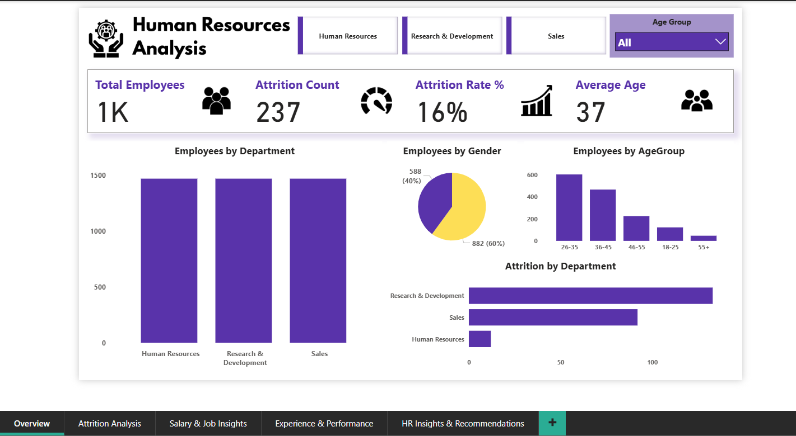
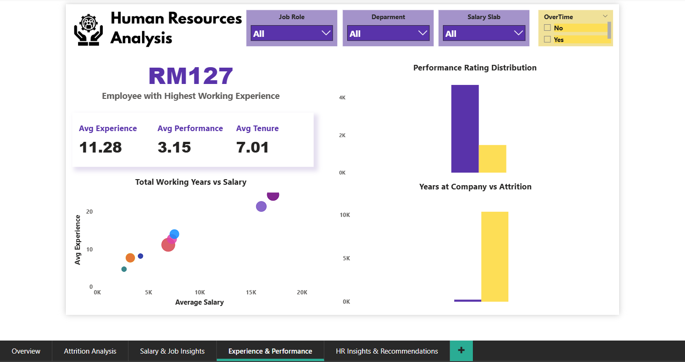
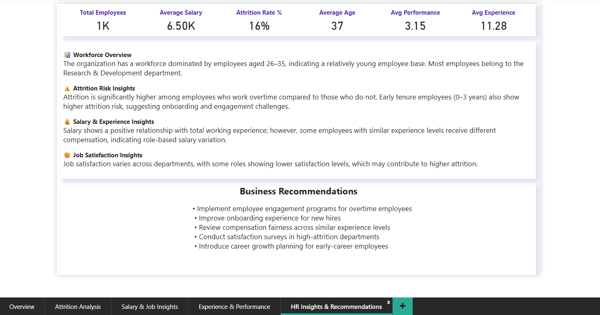

# HR Analytics Dashboard (Power BI)

## 📊 Project Overview

This project presents an interactive HR Analytics Dashboard built using Power BI to analyze employee attrition, salary distribution, performance, and workforce demographics.

The dashboard provides actionable insights to help HR departments improve employee retention and decision-making.

---

## 🚀 Key Features

* Employee Overview & KPIs
* Attrition Analysis
* Salary & Job Insights
* Experience & Performance Analysis
* Business Insights & Recommendations

---

## 📈 Tools & Technologies

* Power BI
* Power Query
* DAX (Data Analysis Expressions)
* Data Modeling
* Data Visualization

---

## 📂 Dataset

HR dataset containing employee demographics, salary, performance, and attrition information.

---

## 📷 Dashboard Screenshots

### Overview

### Attrition Analysis

### Salary Insights

### Experience & Performance

### Insights Page

---

## 💡 Key Insights

* Higher attrition observed among overtime employees
* Majority workforce belongs to the 26–35 age group
* Salary increases with experience but varies across roles
* Early tenure employees show higher attrition risk

---

## 👩‍💻 Author

Your Name: Neha Chaudhari

Aspiring Data Analyst
